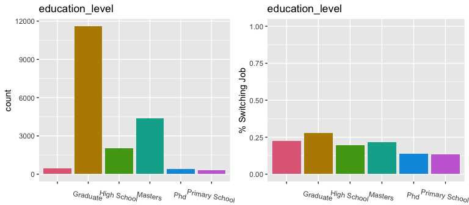
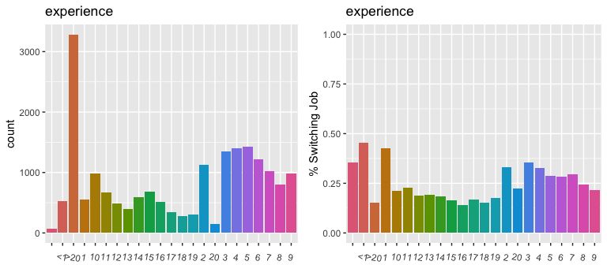
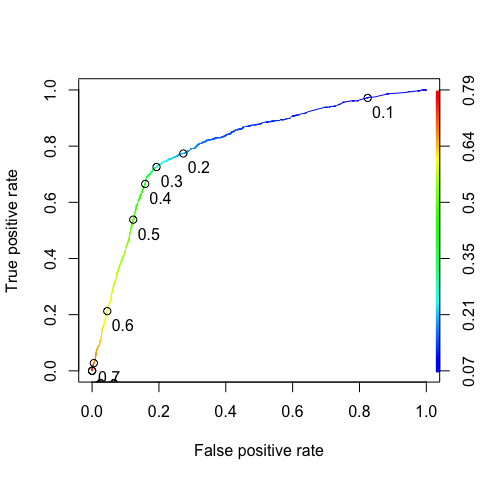

HR Analytics
================
Kun Qian
3/1/2021

  - [1. Exploratory Data Analysis](#exploratory-data-analysis)
      - [1.1 Explore Categorical
        Variables](#explore-categorical-variables)
      - [1.2 Explore Continuous
        Variables](#explore-continuous-variables)
  - [2. Data Cleaning](#data-cleaning)
      - [2.1 Missing Value](#missing-value)
      - [2.2 Categorical Variables Encoding:
        Ordinal](#categorical-variables-encoding-ordinal)
      - [2.3 Categorical Variables Encoding:
        Nominal](#categorical-variables-encoding-nominal)
  - [3.Modeling](#modeling)
      - [3.1Preparation For Modeling](#preparation-for-modeling)
      - [3.2 Logistic Regression](#logistic-regression)
      - [3.2 CART](#cart)
      - [3.2.1 Untuned CART](#untuned-cart)
      - [3.2.2 CART Tuning](#cart-tuning)
          - [3.2.3 Tuned CART Performance](#tuned-cart-performance)
      - [3.3 XGBoost](#xgboost)
          - [3.3.1 Untuned XGBoost](#untuned-xgboost)
          - [3.3.2 Untuned XGBoost
            Performance](#untuned-xgboost-performance)
          - [3.3.3 XGBoost Tuning](#xgboost-tuning)
          - [3.3.4 Tuned XGBoost Model
            Fitting](#tuned-xgboost-model-fitting)
          - [3.3.5 Tuned XGBoost Model Performance - Feature
            Importance](#tuned-xgboost-model-performance---feature-importance)
          - [3.3.6 Tuned XGBoost Model Performance -
            AUC](#tuned-xgboost-model-performance---auc)
          - [3.3.7 Tuned XGBoost Model Performance - Confusion
            Matrix](#tuned-xgboost-model-performance---confusion-matrix)

The goal of this task is building model(s) that uses the current
credentials,demographics,experience to predict the probability of a
candidate looking for a new job or will work for the company.

# 0\. Load Data

``` r
set.seed(42)
# import data
hr <- read.csv("data/aug_train.csv")

# Take a look at the data
str(hr)
```

    ## 'data.frame':    19158 obs. of  14 variables:
    ##  $ enrollee_id           : int  8949 29725 11561 33241 666 21651 28806 402 27107 699 ...
    ##  $ city                  : chr  "city_103" "city_40" "city_21" "city_115" ...
    ##  $ city_development_index: num  0.92 0.776 0.624 0.789 0.767 0.764 0.92 0.762 0.92 0.92 ...
    ##  $ gender                : chr  "Male" "Male" "" "" ...
    ##  $ relevent_experience   : chr  "Has relevent experience" "No relevent experience" "No relevent experience" "No relevent experience" ...
    ##  $ enrolled_university   : chr  "no_enrollment" "no_enrollment" "Full time course" "" ...
    ##  $ education_level       : chr  "Graduate" "Graduate" "Graduate" "Graduate" ...
    ##  $ major_discipline      : chr  "STEM" "STEM" "STEM" "Business Degree" ...
    ##  $ experience            : chr  ">20" "15" "5" "<1" ...
    ##  $ company_size          : chr  "" "50-99" "" "" ...
    ##  $ company_type          : chr  "" "Pvt Ltd" "" "Pvt Ltd" ...
    ##  $ last_new_job          : chr  "1" ">4" "never" "never" ...
    ##  $ training_hours        : int  36 47 83 52 8 24 24 18 46 123 ...
    ##  $ target                : num  1 0 0 1 0 1 0 1 1 0 ...

<br>

# 1\. Exploratory Data Analysis

## 1.1 Explore Categorical Variables

**Write a function to generate two visualizations that allow us to
observe the relationship**

``` r
# visualization
library(ggplot2)
library(dplyr)
library(gridExtra)
library(colorspace)

# Write a function to generate two visualizations that allow us to observe the relationship
# between each categorical variables and the target variable
two_plots <- function(category) {
  # total number of people in each category
  g1 <- ggplot(hr, aes(x={{category}}, fill={{category}})) + 
    geom_histogram(stat="count") + 
    theme(legend.position = 'none') + 
    scale_fill_discrete_qualitative() +
    theme(axis.text.x=element_text(angle=-10),
          axis.title.x = element_blank()) + 
    labs(title = deparse(substitute(category)))
  # Percentage of job switching group by category
  ratio_by_cat <- hr %>% group_by({{category}}) %>% summarise(percent_looking_for_job = sum(target)/n())
  g2 <- ggplot(ratio_by_cat, aes(x={{category}}, y =percent_looking_for_job, fill={{category}})) + 
    geom_col() +
    ylim(0,1) + 
    theme(legend.position = 'none') + 
    ylab("% Switching Job") + 
    scale_fill_discrete_qualitative() +
    theme(axis.text.x=element_text(angle=-10),
          axis.title.x = element_blank()) +
    labs(title = deparse(substitute(category)))
  # group the first two in a same plot
  g3 <- grid.arrange(g1,g2,nrow=1)
}
```

**Now let’s visualize each categorical variable and the target variable,
to identify interesting patterns of job switching decisions.**


``` r
two_plots(gender)
```

<!-- -->

In this sample there’s more male than female. It seems like the gender
balance in Data Science field is still a problem. The pink bin stands
for missing gender.<br/>


``` r
two_plots(relevent_experience)
```

<!-- -->

Most people in this sample has relevant experience in Data Science.
However, those who doesn’t tend to seeking for job change more often.
Maybe those are the people who wants to take the opportunity of this
training and make a career switch.<br/> 


``` r
two_plots(enrolled_university)
```

<!-- -->

Most people are not enrolled in a university right now. People who
enrolled in full time course are likely to look for job change. It makes
sense as most people enroll in universities to either get their first
job or seek for career switch.<br/> 


``` r
two_plots(education_level)
```

<!-- -->

Most people have a master degree. That explains the high
‘no\_enrollment’ in the previous chart. This group of people might
be industry professionals who hold a master degree seeking for career
advancement or career switch. They have the highest intention for job
change.<br/> 


``` r
two_plots(major_discipline)
```

<!-- -->

It’s not surprising that most candidates are from a STEM major as we are
analyzing a Data Science training program. Job switching intential is
even across majors.<br/> 


``` r
two_plots(experience)
```

<!-- -->

More than 3000 people have over 20 years of experience; Only a tiny
amount of people have less than 1 year of experience. This is consistent
with our previous finding that the majority of people are industry
professional looking for career switch or career advancement<br/> 


``` r
two_plots(company_size)
```

<!-- -->
Lots of missing data for company\_size. This could be missing with a
pattern. For example, people might leave it blank if they don’t
currently have a job. Further investigation into how the data is
collected and the missing pattern need to be done before drawing
conclusion. Other than this unknown category, job switch percentage
seems to be relatively even across all company sizes.<br/> 


``` r
two_plots(company_type)
```

<!-- -->

Near 100,000 people are from private limited company. The 2nd most
category is early stage companies, which have the highest percentage of
job switch intention.<br/> 


``` r
two_plots(last_new_job)
```

<!-- -->

Most people only have 1 year between their previous job and current job.

<br>

## 1.2 Explore Continuous Variables

**correlation plot**

``` r
library(corrplot)
# Correlation between continuous variables
num <- hr[,c(3,13,14)]
cor <- cor(num)
corplot <- corrplot(cor, type = 'lower', method = 'number')
```

<!-- -->

City development index has a moderate negative correlation with the
target varibale. That means the more developed the city is, the less
people in that city are likely to look for job change. Also it seems
like training hour is not linearly correlated with job change.

**Look into the relationship between city development index and job
switch rate**

``` r
# Look into the relationship between city development index and job switch rate
cities <- 
  hr %>% group_by(city) %>% 
  summarise(switch_rate = mean(target),
            avg_development_index = mean(city_development_index)) %>% 
  arrange(-switch_rate, -avg_development_index)

ggplot(cities, aes(x=avg_development_index, y=switch_rate, color=city)) + 
  geom_point() +
  theme(legend.position = 'none') +
  ggtitle("Average city development index and job switch rate")
```

<!-- -->

There’s an interesting pattern between city development level and switch
rate. It seems like the job switch rate is high for cities that have a
development index less than 0.6. However, once a city reaches above 0.6,
the job switch rate shows a downward trend for developed cities.

**The distribution of city development index by different target group**

``` r
# The distribution of city development index by different target group
ggplot(hr, aes(x = city_development_index, group=as.factor(target), color=as.factor(target))) + geom_density(stat = 'density')+ ggtitle("Distribution of city development index by target group") + scale_colour_discrete("Switching Job?")
```

<!-- -->

More people at a low city development index are looking for job change,
and less at high development index are looking for job change.

**Distribution of training hours by target group**

``` r
# Distribution of training hours by target group
ggplot(hr, aes(x = training_hours, group=as.factor(target), color=as.factor(target))) + geom_density(stat = 'density')+ ggtitle("Distribution of training hours by target group") + scale_colour_discrete("Switching Job?")
```

<!-- -->

Training hours seem to not affect job switch a lot.

<br>
<br/> 

# 2<br/>. Data Cleaning

## 2.1 Missing Value

``` r
# Check the percentage of missing value in each column, excluding the dummy
sort(colMeans(is.na(hr)), decreasing = TRUE)
```

    ##            enrollee_id                   city city_development_index 
    ##                      0                      0                      0 
    ##                 gender    relevent_experience    enrolled_university 
    ##                      0                      0                      0 
    ##        education_level       major_discipline             experience 
    ##                      0                      0                      0 
    ##           company_size           company_type           last_new_job 
    ##                      0                      0                      0 
    ##         training_hours                 target 
    ##                      0                      0

Not much missing values overall. Let the model handle it first and see
how it goes.

## 2.2 Categorical Variables Encoding: Ordinal

Convert the data type of ordinal categorical variables into integer

  - education\_level

  - company\_size

  - experience

  - last\_new\_job

  - relevant\_experience

  - enrolled\_university

<!-- end list -->

``` r
# replicate the original data frame
hr.cleaned <- hr
# convert education_level
hr.cleaned$education_level[hr.cleaned$education_level=='Primary School'] <- 0
hr.cleaned$education_level[hr.cleaned$education_level=='High School'] <- 1
hr.cleaned$education_level[hr.cleaned$education_level=='Graduate'] <- 2
hr.cleaned$education_level[hr.cleaned$education_level=='Masters'] <- 3
hr.cleaned$education_level[hr.cleaned$education_level=='Phd'] <- 4
hr.cleaned$education_level <- as.integer(hr.cleaned$education_level)

# convert company_size
# table(hr.cleaned$company_size)
hr.cleaned$company_size[hr.cleaned$company_size=='<10'] <- 0
hr.cleaned$company_size[hr.cleaned$company_size=='10/49'] <- 1
hr.cleaned$company_size[hr.cleaned$company_size=='50-99'] <- 2
hr.cleaned$company_size[hr.cleaned$company_size=='100-500'] <- 3
hr.cleaned$company_size[hr.cleaned$company_size=='500-999'] <- 4
hr.cleaned$company_size[hr.cleaned$company_size=='1000-4999'] <- 5
hr.cleaned$company_size[hr.cleaned$company_size=='5000-9999'] <- 6
hr.cleaned$company_size[hr.cleaned$company_size=='10000+'] <- 7
hr.cleaned$company_size <- as.integer(hr.cleaned$company_size)

# convert experience
# table(hr.cleaned$experience)
hr.cleaned$experience[hr.cleaned$experience=='<1'] <- '0'
hr.cleaned$experience[hr.cleaned$experience=='>20'] <- '21'
hr.cleaned$experience <- as.integer(hr.cleaned$experience)

# convert last_new_job
table(hr.cleaned$last_new_job)
```

    ## 
    ##          >4     1     2     3     4 never 
    ##   423  3290  8040  2900  1024  1029  2452

``` r
hr.cleaned$last_new_job[hr.cleaned$last_new_job=='1'] <- 0
hr.cleaned$last_new_job[hr.cleaned$last_new_job=='2'] <- 1
hr.cleaned$last_new_job[hr.cleaned$last_new_job=='3'] <- 2
hr.cleaned$last_new_job[hr.cleaned$last_new_job=='4'] <- 3
hr.cleaned$last_new_job[hr.cleaned$last_new_job=='>4'] <- 4
hr.cleaned$last_new_job[hr.cleaned$last_new_job=='never'] <- 5
hr.cleaned$last_new_job <- as.integer(hr.cleaned$last_new_job)

# convert relevent experience
#table(hr.cleaned$relevent_experience)
hr.cleaned$relevent_experience[hr.cleaned$relevent_experience=='No relevent experience'] <- 0
hr.cleaned$relevent_experience[hr.cleaned$relevent_experience=='Has relevent experience'] <- 1
hr.cleaned$relevent_experience <- as.integer(hr.cleaned$relevent_experience)

# convert enrolled_university
table(hr.cleaned$enrolled_university)
```

    ## 
    ##                  Full time course    no_enrollment Part time course 
    ##              386             3757            13817             1198

``` r
hr.cleaned$enrolled_university[hr.cleaned$enrolled_university=='no_enrollment'] <- 0
hr.cleaned$enrolled_university[hr.cleaned$enrolled_university=='Part time course'] <- 1
hr.cleaned$enrolled_university[hr.cleaned$enrolled_university=='Full time course'] <- 2
hr.cleaned$enrolled_university <- as.integer(hr.cleaned$enrolled_university)
```

## 2.3 Categorical Variables Encoding: Nominal

Use dummy encoding for nominal variables.

  - city

  - gender

  - enrolled\_university

  - major discipline

  - company\_type

<!-- end list -->

``` r
library(caret)
# move all the non-nominal variables to the front
hr.cleaned <- hr.cleaned[,c(14,1,3,5,6,7,9,10,12,13,4,8,11,2)]
# str(hr)

# dummy encoding all the nominal variables
dmy <- dummyVars("~.", data = hr.cleaned)
hr.cleaned <- data.frame(predict(dmy, newdata = hr.cleaned))
#str(hr.cleaned)
```

<br>
<br/> 

# 3.Modeling

## 3.1Preparation For Modeling

``` r
library(caTools)
# split the data set into 80% training, 20% testing, while maintaining the distribution of target variable
split <- sample.split(hr.cleaned$target, 0.8)
train <- hr.cleaned[split==TRUE,]
test <- hr.cleaned[split==FALSE,]

# Check if the distributions are still the same
sum(train$target)/nrow(train)
```

    ## [1] 0.2493639

``` r
sum(test$target)/nrow(test)
```

    ## [1] 0.2492822

**Create a function to calculate auc**

``` r
library(pROC)
# function to get auc on both train and test set
result <- c()
get_auc <- function(model) {
  # train
  predict.train <- predict(model, train)
  auc.train <- roc(train$target, predict.train)
  # test
  predict.test <- predict(model, test)
  auc.test <- roc(test$target, predict.test)
  result <- c(auc.train$auc, auc.test$auc)
  names(result) <- c("train auc", "test auc")
  return(result)
}
```

## 3.2 Logistic Regression

``` r
# logistic regression
model.lr <- glm(target~., data=train, family = gaussian)
# logistic regression
get_auc(model.lr)
```

    ## train auc  test auc 
    ## 0.7981384 0.7688142

## 3.2 CART

## 3.2.1 Untuned CART

``` r
# CART
library(rpart)
library(rpart.plot)

# first, define a basic tree
model.cart <- rpart(target~., train)
# basic auc
get_auc(model.cart)
```

    ## train auc  test auc 
    ## 0.7706857 0.7595151

## 3.2.2 CART Tuning

``` r
# then, tune the tree
library(e1071)
# use 10 folds for cross-validation
numFolds <- trainControl(method='cv', number=10)
# hand pick a sequence of possible cp values
cpGrid = expand.grid(.cp=seq(0.000, 0.2, 0.002))   
# Use the train function to try each of the cp value on cross-validation sets
t <- caret::train(as.factor(target)~., na.omit(train), method='rpart', trControl=numFolds, tuneGrid=cpGrid)
# plot the relationship between cp and accuracy
plot(t$results$cp, t$results$Accuracy, type='b', ylab="Accuracy", xlab="cp")
```

<!-- -->

The best complexity parameter is 0.006

### 3.2.3 Tuned CART Performance

``` r
# fit with the tuned tree
model.cart <- rpart(target~., train, control = rpart.control(cp = t$bestTune$cp))
get_auc(model.cart)
```

    ## train auc  test auc 
    ## 0.7732642 0.7623894

``` r
# visualize the CART model
rpart.plot(model.cart)
```

<!-- -->

The tuned CART model got an AUC of 0.76. According to the plot,
‘city\_development\_index’ is the most significant predictor.
Company\_type comes second.

## 3.3 XGBoost

### 3.3.1 Untuned XGBoost

``` r
library(xgboost)
col.xgb <- c(2:151)
model.xgboost <- xgboost(data = data.matrix(train[,col.xgb]),
                  label = train[,1],
                  nround=100,
                  eval_metric = "auc",
                  objective = "binary:logistic",
                  verbose = 0
                  )
```

### 3.3.2 Untuned XGBoost Performance

``` r
# xgboost on train
pred.xgb.train <- predict(model.xgboost, as.matrix(train[,col.xgb]))
auc.xgb.train <- roc(train$target, pred.xgb.train)
auc.xgb.train
```

    ## 
    ## Call:
    ## roc.default(response = train$target, predictor = pred.xgb.train)
    ## 
    ## Data: pred.xgb.train in 11505 controls (train$target 0) < 3822 cases (train$target 1).
    ## Area under the curve: 0.9351

``` r
# xgboost on test
pred.xgb <- predict(model.xgboost, as.matrix(test[,col.xgb]))
test$pred.xgb <- pred.xgb
auc.xgb <- roc(test$target, test$pred.xgb)
auc.xgb
```

    ## 
    ## Call:
    ## roc.default(response = test$target, predictor = test$pred.xgb)
    ## 
    ## Data: test$pred.xgb in 2876 controls (test$target 0) < 955 cases (test$target 1).
    ## Area under the curve: 0.7879

### 3.3.3 XGBoost Tuning

**XGBoost Tuning: nround** 
What is nround?: It controls the maximum number of iterations. For classification, it is similar to the number of trees to grow.

``` r
# convert dtaframe to DMatrix
dtrain <- xgb.DMatrix(data.matrix(train[,col.xgb]), label=train$target)
dtest <- xgb.DMatrix(data.matrix(test[,col.xgb]), label=test$target)

# setup the default parameter
params <- list(booster="gbtree", objective="binary:logistic", eval_metric='auc' , eta=0.3, gamma=0, max_depth=6, min_child_weight=1, subsample=1, colsample_bytree=1)

# Tuning the parameter 'nrounds' using cross validation
xgbcv <- xgb.cv(params = params, data=dtrain, nrounds=100, nfold=5, showsd=T, stratified=T, print.every.n=10, early_stopping_rounds = 20, maximize = T)
```

    ## [1]  train-auc:0.812272+0.002582 test-auc:0.787053+0.013003 
    ## Multiple eval metrics are present. Will use test_auc for early stopping.
    ## Will train until test_auc hasn't improved in 20 rounds.
    ## 
    ## [11] train-auc:0.861105+0.002973 test-auc:0.800435+0.013501 
    ## [21] train-auc:0.879350+0.004559 test-auc:0.800792+0.013766 
    ## Stopping. Best iteration:
    ## [8]  train-auc:0.849104+0.003489 test-auc:0.801379+0.012724

``` r
xgbcv$best_iteration
```

    ## [1] 8

``` r
# The best nrounds = 8
max(xgbcv$evaluation_log$test_auc_mean)
```

    ## [1] 0.8013788

``` r
# The highest auc on CV set is 0.8014
```

**XGBoost Tuning: grid search** 
Here we tune the following other parameters:

  - eta: It controls the learning rate, i.e., the rate at which our
    model learns patterns in data. After every round, it shrinks the
    feature weights to reach the best optimum.

  - max\_depth: It controls the depth of the tree. Larger the depth,
    more complex the model; higher chances of over-fitting.

  - gamma: It controls regularization (or prevents over-fitting). The
    optimal value of gamma depends on the data set and other parameter
    values.

  - colsample\_bytree: It control the number of features (variables)
    supplied to a tree

<!-- end list -->

``` r
# set up the cross-validated hyper-parameter search
xgb_grid = expand.grid(
  nrounds=xgbcv$best_iteration,
  eta = c(0.1, 0.2, 0.3),
  max_depth = c(3,6,8,10),
  gamma = c(0,1,5),
  colsample_bytree=c(0.5,0.75,1),
  min_child_weight=1,
  subsample=1
)

# pack the training control parameters
xgb_trcontrol = trainControl(
  method = "cv",
  number = 5,
  verboseIter = TRUE,
  returnData = FALSE,
  returnResamp = "all",               # save losses across all models
  classProbs = TRUE,                  # set to TRUE for AUC to be computed
  summaryFunction = twoClassSummary,
  allowParallel = TRUE,
)

# train the model for each parameter combination in the grid,
# using CV to evaluate
train_target = ifelse(train[,1]==1, 'yes','no')
xgb_train_1 = caret::train(x=data.matrix(train[,col.xgb]), y=train_target, trControl = xgb_trcontrol, tuneGrid = xgb_grid, method = "xgbTree")
```

    ## Selecting tuning parameters
    ## Fitting nrounds = 8, max_depth = 6, eta = 0.3, gamma = 0, colsample_bytree = 0.75, min_child_weight = 1, subsample = 1 on full training set

### 3.3.4 Tuned XGBoost Model Fitting

``` r
model.xgboost.super <- xgboost(data = data.matrix(train[,col.xgb]),
                  label = train[,1],
                  nrounds = 8, 
                  max_depth = 6,
                  eta = 0.3, 
                  gamma = 0, 
                  colsample_bytree = 0.75, 
                  min_child_weight = 1, 
                  subsample = 1,
                  eval_metric = "logloss",
                  objective = "binary:logistic",
                  verbose = 0
                  )
```

### 3.3.5 Tuned XGBoost Model Performance - Feature Importance

``` r
#view variable importance plot
mat <- xgb.importance (feature_names = colnames(test[,-1]),model = model.xgboost.super)
xgb.plot.importance (importance_matrix = mat[1:20]) 
```

<!-- -->

According to our best model, city\_development\_index is the best
predictor to whether a candidate is looking for job change or not. From
our previous exploratory analysis, it seems like candidates in a less
developed city are more likely to look for job change. The second
highest predictor is company size. For this one we don’t have much
insight as missing value contributes to the highest company size
category. Again, further investigation on the data collection process
and the missing patter need to be done to get insights.

### 3.3.6 Tuned XGBoost Model Performance - AUC

``` r
# xgboost on train
pred.xgb.s.train <- predict(model.xgboost.super, as.matrix(train[,col.xgb]))
auc.xgb.s.train <- roc(train$target, pred.xgb.s.train)
auc.xgb.s.train
```

    ## 
    ## Call:
    ## roc.default(response = train$target, predictor = pred.xgb.s.train)
    ## 
    ## Data: pred.xgb.s.train in 11505 controls (train$target 0) < 3822 cases (train$target 1).
    ## Area under the curve: 0.8434

``` r
# xgboost on test
pred.xgb.s <- predict(model.xgboost.super, as.matrix(test[,col.xgb]))
test$pred.xgb.s <- pred.xgb.s
auc.xgb.s <- roc(test$target, test$pred.xgb.s)
auc.xgb.s
```

    ## 
    ## Call:
    ## roc.default(response = test$target, predictor = test$pred.xgb.s)
    ## 
    ## Data: test$pred.xgb.s in 2876 controls (test$target 0) < 955 cases (test$target 1).
    ## Area under the curve: 0.8029

``` r
#plot the ROC on the test set
library(ROCR)
ROCRPred <- prediction(test$pred.xgb.s, test$target)
ROCRperf <- performance(ROCRPred,"tpr","fpr")
plot(ROCRperf, colorize=TRUE, print.cutoffs.at=seq(0.1,1,by=0.1), text.adj=c(-0.2,1.7))
```

<!-- -->
Best AUC on the test set: 0.8029

### 3.3.7 Tuned XGBoost Model Performance - Confusion Matrix

``` r
# confusion matrix using the 0.5 cut-off:
xgb.pred <- ifelse(pred.xgb.s>0.5,1,0)
cm <- confusionMatrix(as.factor(xgb.pred), as.factor(test$target), positive='1')
cm
```

    ## Confusion Matrix and Statistics
    ## 
    ##           Reference
    ## Prediction    0    1
    ##          0 2523  441
    ##          1  353  514
    ##                                           
    ##                Accuracy : 0.7927          
    ##                  95% CI : (0.7796, 0.8055)
    ##     No Information Rate : 0.7507          
    ##     P-Value [Acc > NIR] : 4.859e-10       
    ##                                           
    ##                   Kappa : 0.4287          
    ##                                           
    ##  Mcnemar's Test P-Value : 0.002018        
    ##                                           
    ##             Sensitivity : 0.5382          
    ##             Specificity : 0.8773          
    ##          Pos Pred Value : 0.5928          
    ##          Neg Pred Value : 0.8512          
    ##              Prevalence : 0.2493          
    ##          Detection Rate : 0.1342          
    ##    Detection Prevalence : 0.2263          
    ##       Balanced Accuracy : 0.7077          
    ##                                           
    ##        'Positive' Class : 1               
    ## 

Interpretation:

  - Sensitivity indicates that among all the positive cases, our model
    will be able to identify 54% of them.

  - Specificity indicates that among all the cases the model predict
    positive, 88% of them will be actual positive.

This result is good for the purpose of our client. Since training and
planning for a candidate is a costly matter, we don’t want to waste a
lot of resources on those who are not looking for a job change. On the
other hand, it’s okay if we miss some candidates who are indeed looking
for job changes, as the loss is not as big as wasting resources on
unpromising candidates.
